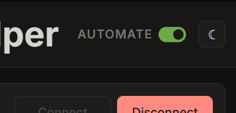

# VPN Helper

Forti mu suka down? Suka mengambil alih jendela yang sedang tampil? Suka tiba-tiba membuka jendela baru padahal lagi fokus kerja? Susah ditakedown?

Coba pake ini. Aku ga jamin anti down, tapi ini ga semaruk Forti dalam menggunakan resource dan jaringan PC mu. Also, dia ga akan ujug-ujug buka tab SSO ketika koneksi VPN naik-turun.

[Langsung ke Persiapan](#persiapan)

---
## Ini Apa?
Intinya ini VPN pengganti Forticlient yang ngaturnya di browser.

---
## Extras
VPN itu pada dasarnya bikin tunnel: jalur khusus dari komputer kita ke jaringan tujuan. Aplikasi ini ngurus login SSO dan sesi gateway-nya, tapi tetap butuh mesin tunnel yang beneran mengangkat traffic jaringan. Mesin itu namanya OpenConnect.

Silakan ikuti langkah menginstal OpenConnect di section [**Persiapan**](#persiapan).


Nyariin fitur ini ya?



Fitur itu udah terinstal di VPN Helper mu tanpa kamu sadari. Kalo mo diaktifkan, chat wa aku ya.

---
## DISCLAIMER
Aplikasi ini baru banget rilis (initial commit 19 Mei 2026) sehingga belum melalui stress test. dengan menggunakannya, anda secara tidak langsung berpartisipasi dalam uji stres sehingga sangat dianjurkan untuk secara aktif melaporkan bug yang anda temui.

---
## Persiapan

1. Clone repo ini atau download ZIP-nya, lalu ekstrak ke folder pilihanmu.

2. Pastikan Python sudah terinstal.

   Biasalah, seluruh app ku pake Python.

3. Install OpenConnect.

   Windows:

   Download OpenConnect CLI 9.12.x untuk Windows 64-bit di sini:
   - [Direct OpenConnect 64-bit installer](https://www.infradead.org/openconnect-gui/download/openconnect-gui-1.6.2-win64.exe)

   Kalau tampil jendela seperti ini saat instalasi, jangan lupa centang console.

   

   Setelah install, pastikan `.env` mengarah ke binary CLI-nya:

   ```env
   openconnect_path=C:\Program Files\OpenConnect\openconnect.exe
   ```

   Cek versinya dari PowerShell:

   ```powershell
   & "C:\Program Files\OpenConnect\openconnect.exe" --version
   ```

   Pastikan yang keluar versi `v9.12` atau 9.x lain, bukan di bawah 9.x.

   Kalau pakai lokasi custom, cukup ganti nilai `openconnect_path` di file `.env`.

   Ubuntu/Debian:

   ```bash
   sudo apt install openconnect
   ```

   Fedora:

   ```bash
   sudo dnf install openconnect
   ```

   Arch:

   ```bash
   sudo pacman -S openconnect
   ```

   macOS:

   ```bash
   brew install openconnect
   ```

4. Install dependensi Python.

   Windows:

   ```bat
   requirements.bat
   ```

   Mac/Linux:

   ```bash
   sh requirements.sh
   ```

   Kalau dependensinya sudah ada, dia tidak install ulang. Kalau sukses, file installer itu akan menghapus dirinya sendiri setelah 3 detik. Kalau Python belum terinstal, dia cuma ngasih tahu lalu keluar tanpa menghapus dirinya.

5. Download file `.env` dari Git BPS ku di [sini](https://git.bps.go.id/gilangprasetyo/vpn-helper), lalu taruh di root folder project ini.

```info
Kenapa .env kupisah ke Git BPS? Isinya konfigurasi sensitif. Walaupun semua orang bisa menguliknya sendiri dengan brainstorming, namun setidaknya bukan karna lihat repoku. 
```

6. Jalankan aplikasi.

   Windows:

   ```bat
   run.bat
   ```

   Mac/Linux:

   ```bash
   sh run.sh
   ```

7. Akses di http://localhost:8765

8. Ada 3 status di aplikasi:

   - SSO: hijau kalau login SSO sudah selesai dan app menerima Authentication ID.
   - Gateway: hijau kalau Authentication ID sudah ditukar menjadi sesi SSL-VPN dan konfigurasi gateway berhasil dibaca.
   - VPN: hijau kalau tunnel OpenConnect sudah aktif.

   Tombolnya sederhana:

   - `Connect`: menjalankan SSO, menyiapkan Gateway, lalu otomatis menjalankan tunnel VPN.
   - `Disconnect`: memutus tunnel VPN dan membersihkan sesi SSO/Gateway, supaya connect berikutnya mulai dari sesi baru.

---

## QnA
Feel free to reach me out via WhatsApp.

---

## License

This project is distributed under the VPN Helper Use-Only License.

Use of this software is free of charge. Modification, publication of modified versions, sublicensing, selling, renting, or repackaging requires prior written permission from the copyright holder.

See [LICENSE](LICENSE) for the full English and Indonesian license text.
